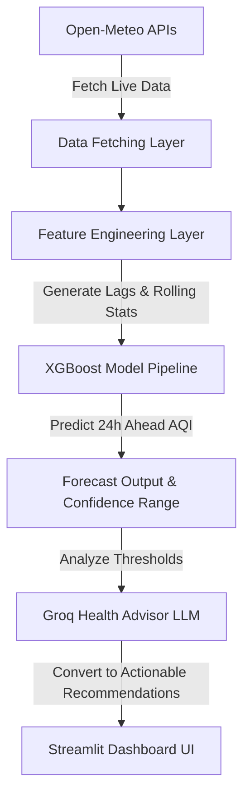

# Mumbai AQI Forecast & AI Health Advisor

[](https://www.python.org/)
[](https://streamlit.io/)
[](https://xgboost.readthedocs.io/)
[](https://groq.com/)
[](https://open-meteo.com/)

---

## 📌 Project Overview
Air pollution significantly impacts public health in Indian metropolitan cities, particularly in Mumbai. Traditional forecasting methods rely on numerical thresholds that can be difficult for the general public to translate into daily actionable advice. 

This project solves this by forecasting Mumbai's Air Quality Index (AQI) 24 hours ahead using an **XGBoost Regressor** trained on historical meteorological and pollutant data. It then utilizes a **Groq LLM (Llama-3.3-70b)** as an AI Health Advisor to convert raw numerical predictions into clear, practical health recommendations for both the general public and sensitive groups.

---

## 🚀 Features
- **Live AQI Monitoring**: Fetches real-time air quality metrics from Open-Meteo's Air Quality API.
- **24-Hour AQI Forecasting**: Predicts AQI 24 hours ahead using a machine learning model.
- **Real-Time Weather Integration**: Merges current meteorological variables (temperature, humidity, wind, pressure, precipitation) with pollutants.
- **XGBoost-Based Prediction Engine**: High-performance, optimized regressor built on historical Mumbai patterns.
- **AI-Powered Health Advisor**: Dynamic recommendations generated in real-time via Groq Cloud APIs.
- **AQI Category Classification**: Classifies forecasted values into categories from "Good" to "Hazardous".
- **AQI Gauge Visualization**: Beautiful, interactive gauge chart showing the warning band.
- **Forecast Confidence Intervals**: Displays prediction uncertainty intervals calculated using the model's baseline RMSE.
- **Explainable Predictions**: Showcases model drivers based on feature importance.
- **Interactive Streamlit Dashboard**: Responsive, clean sidebar navigation, and detailed data trends.

---

## 📊 Dashboard Preview
Below are placeholders for the dashboard previews. Once you deploy your application locally or on Streamlit Community Cloud, capture screenshots and save them in the `assets/` folder to populate these previews:

### 1. Main Dashboard View

*(Placeholder: Capture a screenshot of the main Streamlit screen showing the metric row and line chart, and replace `assets/dashboard.png`)*

### 2. Interactive AQI Gauge

*(Placeholder: Capture a screenshot of the Plotly gauge visual, and replace `assets/gauge.png`)*

### 3. AI Health Advisor Card

*(Placeholder: Capture a screenshot of the Groq-generated health recommendation block, and replace `assets/advisor.png`)*

---

## 🏗️ Project Architecture


---

## 📁 Dataset & Data Sources
- **Training Data**: 1 year of hourly historical air quality, pollutant data, and weather measurements for Mumbai, India.
- **Data Sources**:
  - **Open-Meteo Air Quality API**: Historical and live hourly pollutant concentrations ($PM_{2.5}, PM_{10}, NO_2, O_3, SO_2, CO$) and US AQI.
  - **Open-Meteo Weather API**: Historical and live weather factors (temperature, relative humidity, wind speed, wind direction, surface pressure, precipitation).
- **Inference**: Live predictions fetch current API responses and compute features on-the-fly.

---

## 🛠️ Feature Engineering
To maximize the predictive power of our tabular data, the following features are engineered:
1. **Temporal Features**:
   - `hour`, `day_of_week`, `month`, `week_of_year`
2. **Lag Features**:
   - `aqi_lag_1`, `aqi_lag_3`, `aqi_lag_6`, `aqi_lag_12`, `aqi_lag_24`, `aqi_lag_48` (to capture autocorrelation in atmospheric states).
3. **Rolling Statistics**:
   - `aqi_roll_mean_24`, `aqi_roll_std_24`, `pm25_roll_mean_24` (24-hour moving average and volatility).
4. **Cyclical Encodings**:
   - Sine/Cosine transformations of `hour` and `month` to model daily and annual seasonality continuously.

---

## 📈 Model Performance
We evaluated the model against a baseline regressor using historical data:

| Model | MAE | RMSE | $R^2$ |
| :--- | :--- | :--- | :--- |
| **Baseline Model (Linear Regression)** | 10.45 | 15.88 | 0.565 |
| **XGBoost Regressor** | **9.86** | **14.80** | **0.623** |

### Why XGBoost?
- **Non-Linear Relationships**: Air pollution patterns are highly non-linear, influenced by sudden weather fluctuations and traffic peaks.
- **Feature Interaction**: Handles collinear temporal and meteorology inputs without overfitting.
- **Robustness**: Efficiently processes missing observations or API outliers using directional splits.

---

## 🔑 Feature Importance
Based on the trained XGBoost feature scoring, the top drivers behind predictions are:
1. `aqi_lag_1` (Immediate history / temporal persistence)
2. `us_aqi` (Current hour AQI baseline)
3. `pm2_5` (Dominant particulate pollutant)
4. `hour` (Diurnal variations / traffic cycles)
5. `surface_pressure` (Meteorological weight influencing dispersion)

*Interpretation: The model heavily relies on spatial and temporal persistence (prior AQI) combined with weather variables like surface pressure that restrict or promote pollutant dispersal in Mumbai.*

---

## 🤖 AI Health Advisor
Raw numbers like "AQI: 125" are abstract. Through Groq Cloud's Llama-3.3 LLM interface, the model translates numerical predictions into custom target recommendations:
- **General Public**: Guidance on physical outdoor activities, face masks, and transport.
- **Sensitive Groups**: Special health suggestions for children, elderly individuals, and those with respiratory conditions.

*Disclaimer: Health recommendations generated by this system are for informational purposes only and do not replace professional medical advice.*

---

## ⚙️ Installation & Setup

### Prerequisites
- Python 3.9 or higher
- A Groq API Key (Sign up at [Groq Console](https://console.groq.com/))

### Step 1: Clone the Repository
```bash
git clone https://github.com/your-username/AQI-Forecast-Health-Advisor-Mumbai.git
cd AQI-Forecast-Health-Advisor-Mumbai
```

### Step 2: Set Up Virtual Environment
```bash
# Windows
python -m venv .venv
.venv\Scripts\activate

# macOS/Linux
python3 -m venv .venv
source .venv/bin/activate
```

### Step 3: Install Dependencies
```bash
pip install -r requirements.txt
```

### Step 4: Configure Secrets
Create a folder named `.streamlit` and a file named `secrets.toml` inside it:
```bash
mkdir .streamlit
touch .streamlit/secrets.toml
```
Open `.streamlit/secrets.toml` and add your Groq API key:
```toml
GROQ_API_KEY = "your-actual-groq-api-key-here"
```

### Step 5: Run the Dashboard
```bash
streamlit run app.py
```

---

## 🔮 Future Roadmap
- **Multi-City Forecasting**: Expand models to forecast AQI in other major Indian hubs like Delhi, Bangalore, and Kolkata.
- **Extended Horizon**: Adapt training pipelines for 48-hour and 72-hour forecast windows.
- **User Geolocation**: Automatically serve forecast data based on user IP or GPS.
- **Push Alerts**: E-mail or mobile notifications if forecasted AQI breaches "Unhealthy" bounds.

---

## 🛠️ Technology Stack
- **Languages & Utilities**: Python, Joblib
- **Data Engineering**: Pandas, NumPy, Scikit-learn
- **Machine Learning**: XGBoost Regressor
- **Generative AI**: Groq Cloud SDK, Llama-3.3-70b-versatile
- **Visualization**: Plotly (Gauge, Indicator), Streamlit Charts
- **UI Framework**: Streamlit Dashboard, HTML/CSS
- **Data APIs**: Open-Meteo Air Quality & Weather API

---

## 💼 Resume & Portfolio Impact
This project demonstrates several production-ready competencies:
- **End-to-End ML Pipeline**: Seamless integration from raw API data extraction, lag-feature computation, to regression inference.
- **Explainable AI (XAI)**: Displaying top feature drivers to explain the models' predictions.
- **LLM Agent Orchestration**: Leveraging LLMs to synthesize raw telemetry into readable text.
- **Production Dashboarding**: Serving models and predictions interactively through Streamlit with modern layouts.

---

## 🙏 Acknowledgements
- [Open-Meteo API](https://open-meteo.com/) for making premium environmental telemetry accessible.
- [Groq](https://groq.com/) for offering ultra-fast inference APIs.
- [Streamlit](https://streamlit.io/) for the simple and powerful app framework.

---

## 📄 License
This project is licensed under the [MIT License](LICENSE).
