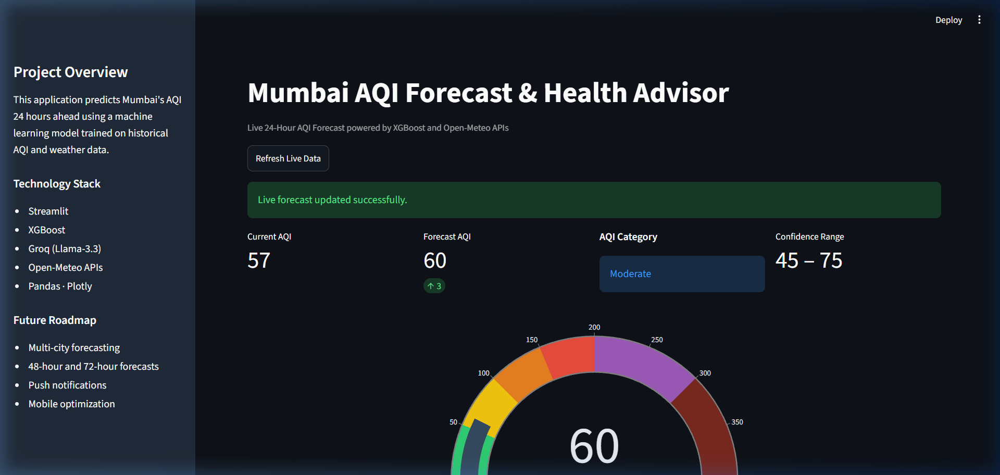
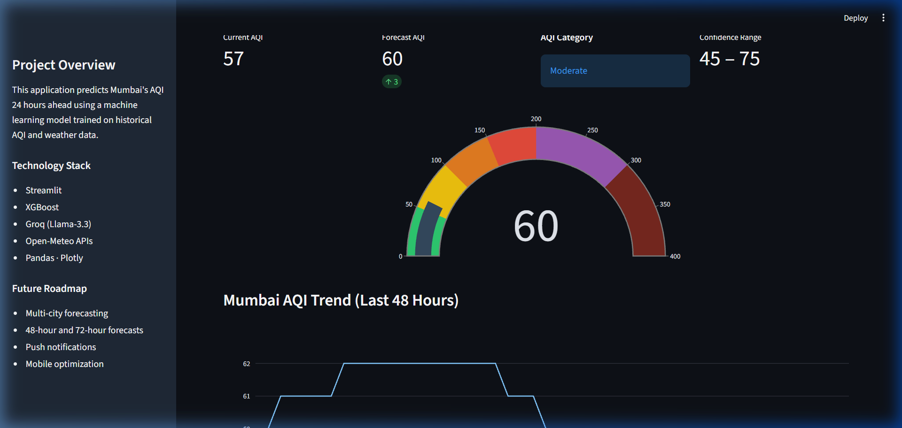
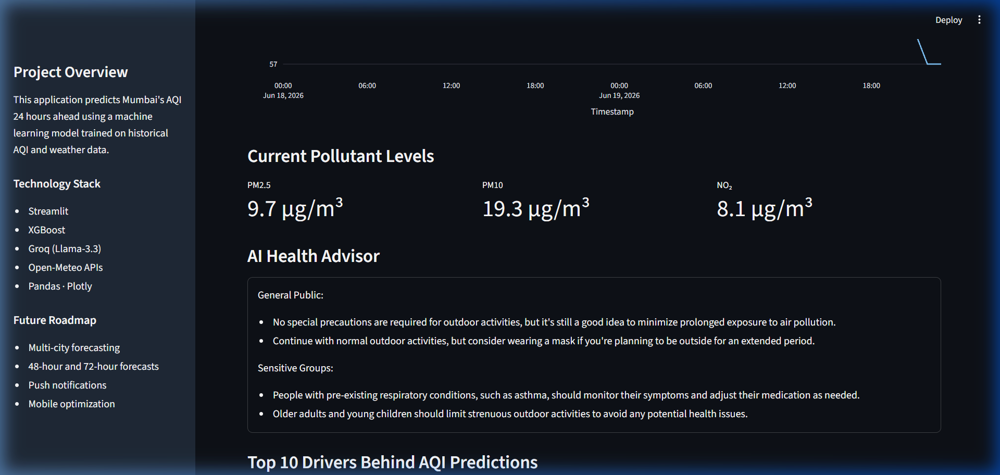
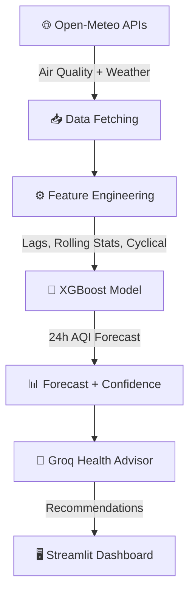

# 🌫️ Mumbai AQI Forecast & AI Health Advisor

[](https://www.python.org/)
[](https://streamlit.io/)
[](https://xgboost.readthedocs.io/)
[](https://groq.com/)
[](https://open-meteo.com/)
[](LICENSE)

---

## 📌 Project Overview

Air pollution is one of the most pressing public health challenges in Indian metropolitan cities. Mumbai, with its high population density and industrial activity, frequently experiences hazardous air quality levels that can trigger respiratory illness, cardiovascular problems, and reduced quality of life.

This project forecasts Mumbai's **Air Quality Index (AQI) 24 hours ahead** using an **XGBoost Regressor** trained on one year of historical air quality and meteorological data. The raw numerical prediction is then passed to a **Groq LLM (Llama-3.3-70b)** that generates clear, actionable health recommendations for both the general public and sensitive groups.

**Why it matters:** Traditional AQI dashboards show current readings but offer no forward-looking guidance. This project bridges that gap — enabling citizens, schools, and health authorities to plan ahead based on predicted air quality.

---

## 🚀 Features

| Category | Feature |
|:---|:---|
| **Monitoring** | Live AQI fetching from Open-Meteo Air Quality API |
| **Forecasting** | 24-hour ahead AQI prediction using XGBoost |
| **Weather** | Real-time weather data integration (temperature, humidity, wind, pressure) |
| **AI Advisor** | Groq LLM-powered health recommendations with automatic fallback |
| **Visualization** | Interactive Plotly gauge chart with AQI category bands |
| **Confidence** | Forecast uncertainty intervals (RMSE-based) |
| **Explainability** | Top 10 feature importance drivers displayed as a bar chart |
| **Classification** | AQI category labels (Good → Hazardous) with colored indicators |
| **Pollutants** | Live PM2.5, PM10, and NO₂ concentration metrics |
| **Dashboard** | Responsive Streamlit dashboard with sidebar navigation |

---

## 📊 Dashboard Preview

### Main Dashboard


### AQI Gauge Visualization


### AI Health Advisor


---

## 🏗️ Project Architecture



---

## 📁 Dataset & Data Sources

### Training Data
- **Duration:** 1 year of hourly observations
- **Location:** Mumbai, India (19.0760°N, 72.8777°E)
- **Pollutants:** PM2.5, PM10, NO₂, O₃, SO₂, CO, US AQI
- **Weather:** Temperature, relative humidity, wind speed, wind direction, surface pressure, precipitation

### Data Sources

| Source | Endpoint | Purpose |
|:---|:---|:---|
| Open-Meteo Air Quality API | `air-quality-api.open-meteo.com` | Pollutant concentrations & AQI |
| Open-Meteo Weather API | `api.open-meteo.com` | Meteorological variables |

### Live Inference
During live inference the app fetches **7 days of historical data** from both APIs, engineers features on-the-fly, and feeds the latest row to the trained model. No stored datasets are needed at runtime.

---

## 🛠️ Feature Engineering

### Temporal Features
`hour`, `day_of_week`, `month`, `week_of_year`

### Lag Features
| Feature | Description |
|:---|:---|
| `aqi_lag_1` | AQI from 1 hour ago |
| `aqi_lag_3` | AQI from 3 hours ago |
| `aqi_lag_6` | AQI from 6 hours ago |
| `aqi_lag_12` | AQI from 12 hours ago |
| `aqi_lag_24` | AQI from 24 hours ago |
| `aqi_lag_48` | AQI from 48 hours ago |

### Rolling Statistics (24-hour window)
- `aqi_roll_mean_24` — 24h moving average of AQI
- `aqi_roll_std_24` — 24h rolling standard deviation of AQI
- `pm25_roll_mean_24` — 24h moving average of PM2.5

### Cyclical Encodings
Sine and cosine transformations of `hour` (period=24) and `month` (period=12) to capture daily and seasonal cycles without introducing artificial discontinuities.

---

## 📈 Model Performance

| Metric | Baseline (Linear Regression) | XGBoost Regressor |
|:---|:---:|:---:|
| **MAE** | 10.45 | **9.86** |
| **RMSE** | 15.88 | **14.80** |
| **R²** | 0.565 | **0.623** |

### Why XGBoost?
- **Non-linear patterns:** Air pollution is influenced by complex interactions between weather, traffic, and industrial emissions.
- **Feature interactions:** XGBoost natively captures interactions between temporal lags and meteorological variables.
- **Missing data handling:** Directional splits handle intermittent API gaps gracefully.
- **Fast inference:** Predictions complete in milliseconds — suitable for a real-time dashboard.

---

## 🔑 Top 10 Feature Importance

| Rank | Feature | Importance | Interpretation |
|:---:|:---|:---:|:---|
| 1 | `aqi_lag_1` | 0.462 | Strong temporal persistence — recent AQI is the best predictor |
| 2 | `us_aqi` | 0.317 | Current-hour baseline anchors the forecast |
| 3 | `pm2_5` | 0.029 | Dominant particulate pollutant in Mumbai |
| 4 | `hour` | 0.019 | Diurnal traffic and industrial cycles |
| 5 | `surface_pressure` | 0.014 | Atmospheric stability affects pollutant dispersal |
| 6 | `pm25_roll_mean_24` | 0.012 | Daily PM2.5 trend |
| 7 | `week_of_year` | 0.011 | Seasonal patterns (monsoon vs. winter) |
| 8 | `relative_humidity_2m` | 0.010 | Humidity influences particulate settling |
| 9 | `precipitation` | 0.010 | Rain washes pollutants from the atmosphere |
| 10 | `aqi_lag_6` | 0.010 | Medium-term atmospheric memory |

The model relies heavily on **temporal persistence** (prior AQI values) combined with **meteorological variables** that govern pollutant dispersal in Mumbai's coastal environment.

---

## 🤖 AI Health Advisor

Raw numbers like *"AQI: 125"* are abstract and hard to act on. The AI Health Advisor translates the numerical forecast into **practical, category-specific guidance**:

- **General Public:** Outdoor activity recommendations, mask guidance, transport suggestions.
- **Sensitive Groups:** Targeted advice for children, elderly, and individuals with respiratory or cardiovascular conditions.

The advisor is powered by **Groq Cloud's Llama-3.3-70b-versatile** model. If the Groq API is unavailable or not configured, the system automatically falls back to pre-written, category-matched recommendations — the dashboard **never crashes**.

> **Disclaimer:** Health recommendations are for informational purposes only and do not replace professional medical advice.

---

## ⚙️ Installation & Setup

### Prerequisites
- Python 3.9 or higher
- A free [Groq API Key](https://console.groq.com/) (optional — fallback advice works without it)

### Step 1: Clone the Repository
```bash
git clone https://github.com/yach26/AQI-Forecast-Health-Advisor-Mumbai.git
cd AQI-Forecast-Health-Advisor-Mumbai
```

### Step 2: Create Virtual Environment
```bash
# Windows
python -m venv .venv
.venv\Scripts\activate

# macOS / Linux
python3 -m venv .venv
source .venv/bin/activate
```

### Step 3: Install Dependencies
```bash
pip install -r requirements.txt
```

### Step 4: Configure Secrets
```bash
cp .streamlit/secrets.toml.example .streamlit/secrets.toml
```
Then edit `.streamlit/secrets.toml` and replace the placeholder with your actual Groq API key:
```toml
GROQ_API_KEY = "gsk_your_actual_key_here"
```

### Step 5: Run the Dashboard
```bash
streamlit run app.py
```
The dashboard will open at `http://localhost:8501`.

---

## 🔐 Environment Variables

| Variable | Required | Description |
|:---|:---:|:---|
| `GROQ_API_KEY` | Optional | Groq Cloud API key for the AI Health Advisor. If missing, pre-written fallback advice is shown. |

Secrets are stored in `.streamlit/secrets.toml`, which is **excluded from version control** via `.gitignore`.

---

## 🧪 Reproducibility Notes

### Model Training
The trained model (`model/aqi_model_24h.pkl`) is included in this repository. To retrain:
1. Collect historical data using the Open-Meteo APIs (see `notebooks/aqi-weather-data-mumbai.ipynb`).
2. Run the training notebook to generate a new `.pkl` file and updated `feature_columns.json`.
3. Replace the files in `model/`.

### Live Inference
- The app fetches **7 days** of historical data at runtime to compute lag and rolling features.
- No local dataset files are needed — all inference data comes from the Open-Meteo APIs.
- Predictions are cached for 30 minutes (`st.cache_data(ttl=1800)`) to avoid excessive API calls.

---

## 🔮 Future Improvements

- **Multi-City Forecasting** — Expand to Delhi, Bangalore, Kolkata, and other Indian metros.
- **Extended Horizons** — 48-hour and 72-hour forecast windows.
- **User Geolocation** — Automatically detect user location and serve relevant forecasts.
- **Email / Push Alerts** — Notify users when forecasted AQI breaches "Unhealthy" thresholds.
- **Mobile Optimization** — Responsive design for mobile browsers.

---

## 🛠️ Technology Stack

| Layer | Technologies |
|:---|:---|
| **Language** | Python 3.9+ |
| **ML Framework** | XGBoost, Scikit-learn |
| **Generative AI** | Groq Cloud SDK, Llama-3.3-70b-versatile |
| **Data Processing** | Pandas, NumPy |
| **Visualization** | Plotly (Gauge, Line Charts) |
| **Dashboard** | Streamlit |
| **Data APIs** | Open-Meteo Air Quality & Weather API |
| **Serialization** | Joblib |

---

## 💼 Why This Project Matters

This project demonstrates several production-grade competencies valued in ML engineering roles:

| Competency | Demonstrated By |
|:---|:---|
| **End-to-End ML Pipeline** | Raw API data → feature engineering → model inference → dashboard |
| **Real-Time Inference** | Live API fetching with caching and error boundaries |
| **Feature Engineering** | Lag features, rolling statistics, cyclical encodings |
| **Explainable AI** | Feature importance visualization with interpretation |
| **LLM Integration** | Groq API orchestration with graceful fallback |
| **Production Robustness** | Error handling, input validation, cached resources |
| **Dashboard Deployment** | Interactive Streamlit app with responsive layout |

---

## 🙏 Acknowledgements

- [Open-Meteo](https://open-meteo.com/) — Free, open-source weather and air quality APIs.
- [Groq](https://groq.com/) — Ultra-fast LLM inference APIs.
- [Streamlit](https://streamlit.io/) — The fastest way to build ML-powered web apps.
- [XGBoost](https://xgboost.readthedocs.io/) — Scalable gradient boosting framework.

---

## 📄 License

This project is licensed under the [MIT License](LICENSE).
